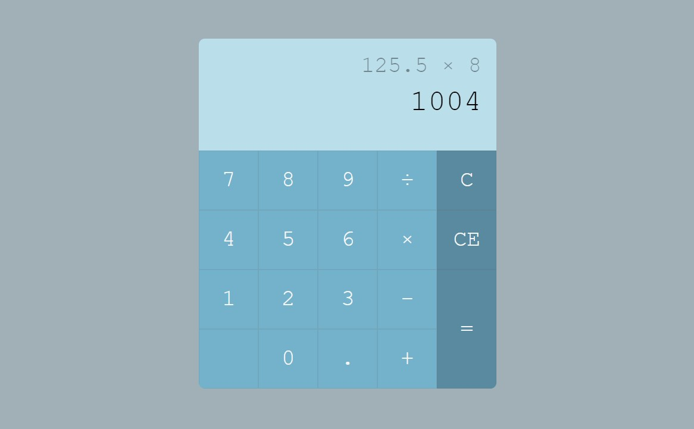

Simple Web Calculator
=====================
간단한 사칙연산이 필요할 때 Simple Web Calculator를 이용해보세요!

 
</img> 

📝 About The Project
-----------------------------------------
Simple Web Calculator는 웹 페이지에서 이용할 수 있는 계산기입니다. HTML, CSS, JavaScript를 이용해 만들었으며, 눈에 편안한 그린 계열의 색상을 이용하여 테마를 잡았습니다.

💻 Demo Page
-----------------------------------------
데모 페이지는 [여기](https://vilin0x6.github.io/calculator)에서 확인할 수 있습니다.

Simple Web Calculator를 직접 체험해보세요.

💭 Next Version Preview
-----------------------------------------
현재 개선해야할 부분이 몇 가지 있으며 다음 버전에서는 이 부분들이 수정될 예정입니다.

개선해야할 부분 목록
1. 'CE'를 누른 후에는 소수점 입력이 되지 않음
2. 연산을 하고 '='를 눌러 결과값이 나온 상태에서 숫자를 재입력 하였을 때, 결과값 뒤에 숫자가 입력됨

추가적으로, 마우스 클릭이 아닌 키보드 자판으로 숫자를 입력할 때에도 작동이 되도록 구현할 예정이며, 밝은모드/다크모드 등 테마를 직접 선택할 수 있는 기능도 추가할 예정입니다.
